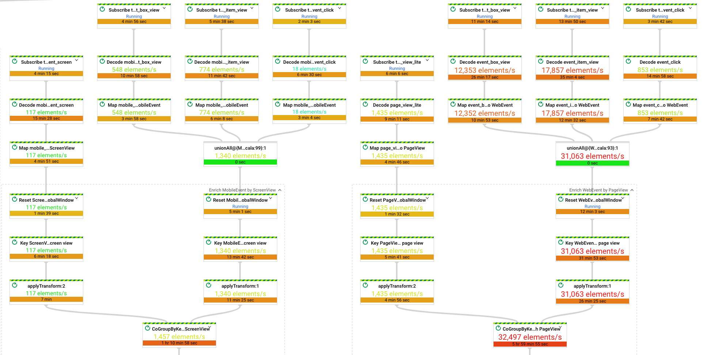

# GCP Dataflow UI extension for finding job bottlenecks

[Tampermonkey](https://www.tampermonkey.net) script for GCP Dataflow console with enhanced view for finding job bottlenecks. 

## Features

* Formatting elapsed time, more time is taken by the step - the step is more visible on the console.
* Formatting throughput, more elements per second is processed - the step is more visible on the console.

[Full size version](gcp-dataflow-tampermonkey-large.png) 

## Installation

Follow the [Tampermonkey documentation](https://www.tampermonkey.net/faq.php?ext=dhdg#Q102).

## Changelog

### 1.0

* Update for the new version of Dataflow console.
* Minor tweaks for colouring labels when few steps take much more time than others.

### 0.1

* Initial version developed by [Tomek Nurkiewicz](https://github.com/nurkiewicz) - thanks!!!!
